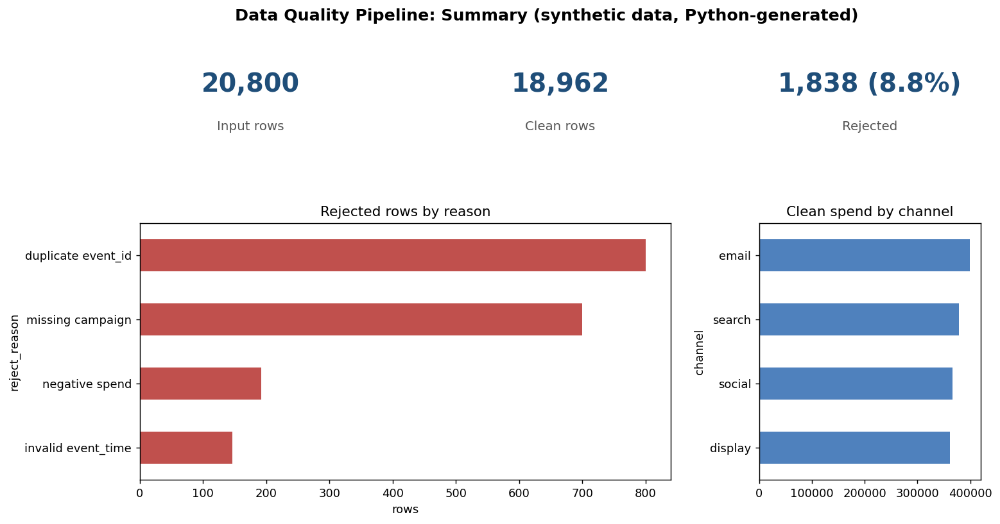

# Data Quality Pipeline

A repeatable data-cleaning pipeline with explicit validation rules. It stops bad data (nulls, duplicates, invalid values) from reaching the reporting layer, and records every rejected row with a reason so issues can be fixed at the source.

> **Data notice:** This repository uses a **synthetic dataset** created by `generate_data.py` to mimic messy marketing and system event logs. It contains no real company data.

## Business problem

An operational reporting dashboard kept failing or showing wrong metrics because the raw data had consistency issues, and analysts spent time checking numbers by hand before each management review.

## What the pipeline does

| Rule | Action |
|------|--------|
| Duplicate `event_id` | Reject, keep the first |
| Missing `campaign` | Reject |
| Unparseable `event_time` | Reject |
| `channel` not in the allowed list | Reject (after trimming and lower-casing) |
| Negative `spend` | Reject |
| Missing `clicks` | Fill with 0 (documented assumption) |

Clean rows go to `output/clean_events.csv`. Rejected rows go to `output/rejected_rows.csv` with a `reject_reason` column.

## Project structure

```
.
├── generate_data.py              # synthetic messy dataset
├── pipeline.py                   # Python cleaning + validation (pure `clean()` function)
├── make_dashboard.py             # static summary image
├── powerquery/clean_events.m     # same rules as a Power Query (M) query for Power BI
├── tests/test_pipeline.py        # unit tests for each rule
├── requirements.txt
├── data/                         # generated input (git-ignored)
└── output/                       # generated results (git-ignored)
```

## How to run

```bash
python -m venv .venv && source .venv/bin/activate   # Windows: .venv\Scripts\activate
pip install -r requirements.txt
python generate_data.py
python pipeline.py
python make_dashboard.py   # optional: summary image
PYTHONPATH=. pytest        # Windows PowerShell: $env:PYTHONPATH="."; pytest
```

## Example run (synthetic data)

```
Input rows : 20,800
Clean rows : 18,962
Rejected   : 1,838
```

## Summary image

`make_dashboard.py` creates a static summary image with matplotlib. It is a Python visual, **not a Power BI report**.



## Using it in Power BI

In Power BI Desktop choose **Get Data > Blank Query > Advanced Editor**, paste `powerquery/clean_events.m`, and update the file path. The report then refreshes from cleaned data every time.

## Tools

Python (pandas, pytest), Power Query (M), Power BI.

## License

MIT, see [LICENSE](LICENSE).
